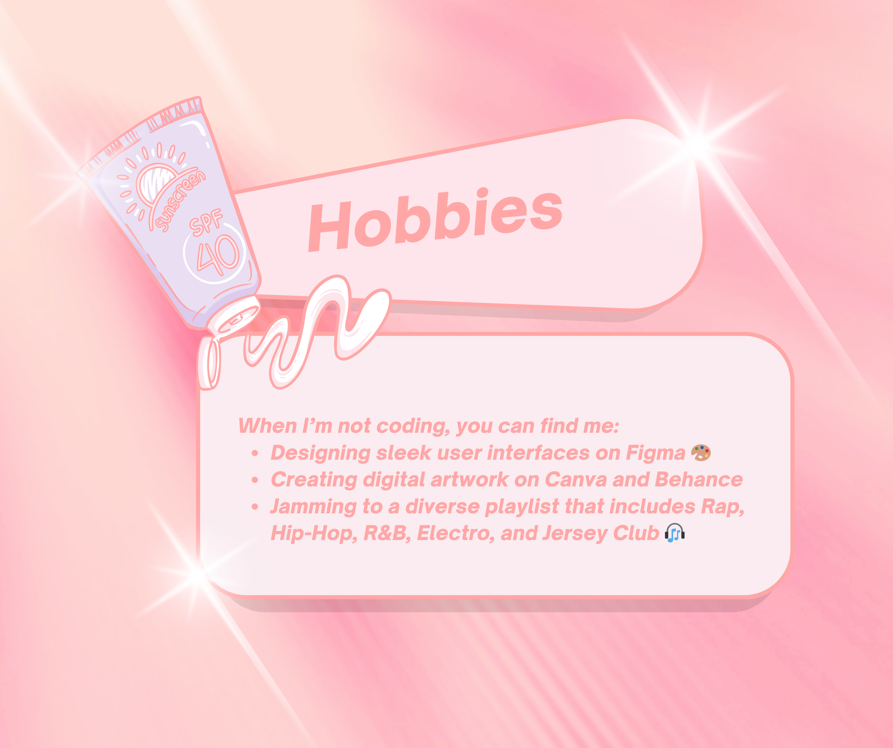

🎓 Studying Computer Science at the University of London

## 👧🏽 About Me

I’m currently pursuing a degree in Computer Science with a specialization in Artificial Intelligence and Machine Learning at the University of London. I'm passionate about leveraging technology to solve real-world problems and am actively involved in projects that span across web development, AI, data science, software development, and more.

🎨 Beyond the world of code, I immerse myself in the creative realms of design and art, utilizing platforms like Figma, Canva, and Behance to bring innovative ideas to life. Whether it’s software design or general artistic endeavors, I love to blend aesthetics with functionality.

## 👩🏽‍💻 Tech Stack

- **Programming Languages**: Python 🐍, C++, JavaScript (JS), PHP, C#
- **Databases**: MySQL,  PostgreSQL, Redis
- **Web Development**: React, Node.js, HTML, CSS, TailwindCSS, Bootstrap
- **Tools**: Git, VS Code, Figma, Canva, Linear, Miro, Adobe XD 
- **Fields of Interest**: Web Development, AI, Data Science, Database Management, Software Engineering, Mathematics, Art and Design
    

## 🍀 Skills
- **Management methodologies**: Kanban, Agile

  
## 📩 Let's Connect
- LinkedIn: [Angela LinkedIn](https://www.linkedin.com/in/isonoangelapaola/)
- Profile Coursera: [Angela Coursera](https://www.coursera.org/user/f27d45b8ffcf61dfd53b1af9dfc65773)

I'm always open to collaborating on interesting projects and innovative ideas. Feel free to reach out if you want to talk tech or design!

# ¡Ahora Conóceme en Español!

Para dirigirte a los links descarga la versión oficial aquí: [CV-comprimido](https://github.com/angelaL8a/angelaL8a/blob/main/CV/CV-compressed.pdf)

     
     
     
    

     
     
    <a href="https://www.credly.com/badges/024daddb-fb4b-41ea-9130-fbc9addc1318/public_url">
        
    </a 
    

     
    
     
    

     
     
     
    

     
     

